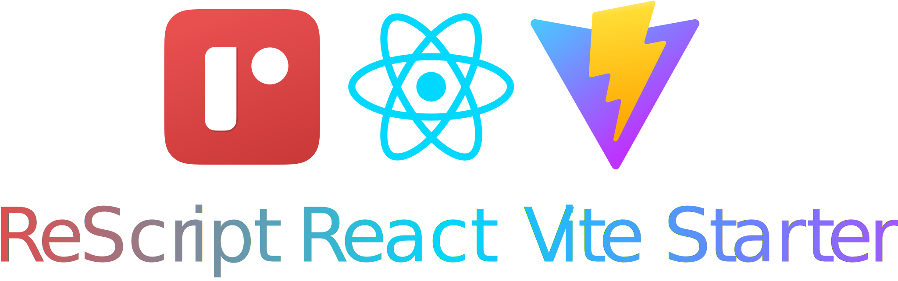

<br />

<p align="center" >
    
</p>
<br />
<br />


### 💻 Scripts:

```bash
git clone https://github.com/Deep-Codes/rescript-react-vite-starter
cd rescript-react-vite-starter
yarn
```

- `yarn clean` : clean compiled *.bs.js
- `yarn start` : compile resript files with watch
- `yarn dev` : start vite dev server
- `yarn build` : build for production
- `yarn serve` : locally preview production build


### 🏗 Contributing:

Contributions are what make the open source community such an amazing place to be learn, inspire, and create. Any contributions you make are **greatly appreciated**.

1. Fork the Project
2. Create your Feature Branch (`git checkout -b feature/AmazingFeature`)
3. Commit your Changes (`git commit -m 'Add some AmazingFeature'`)
4. Push to the Branch (`git push origin feature/AmazingFeature`)
5. Open a Pull Request

